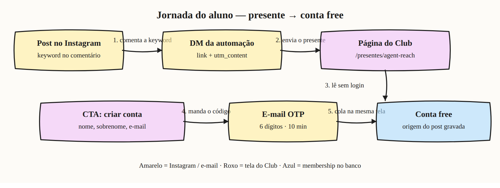
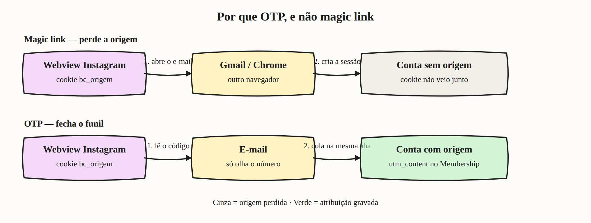
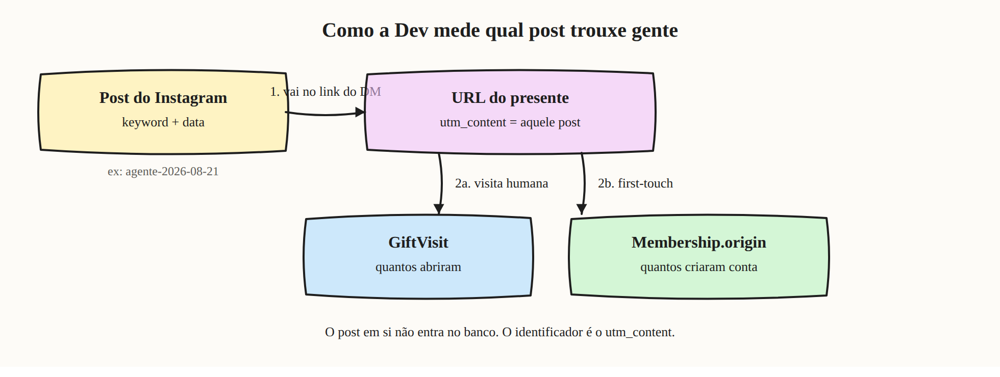
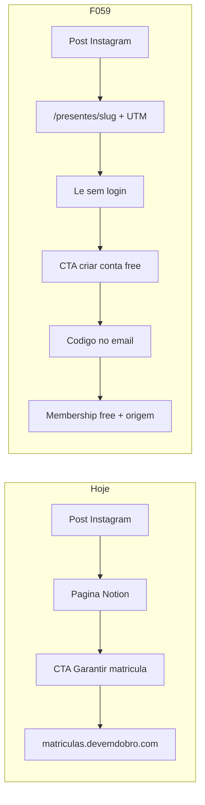
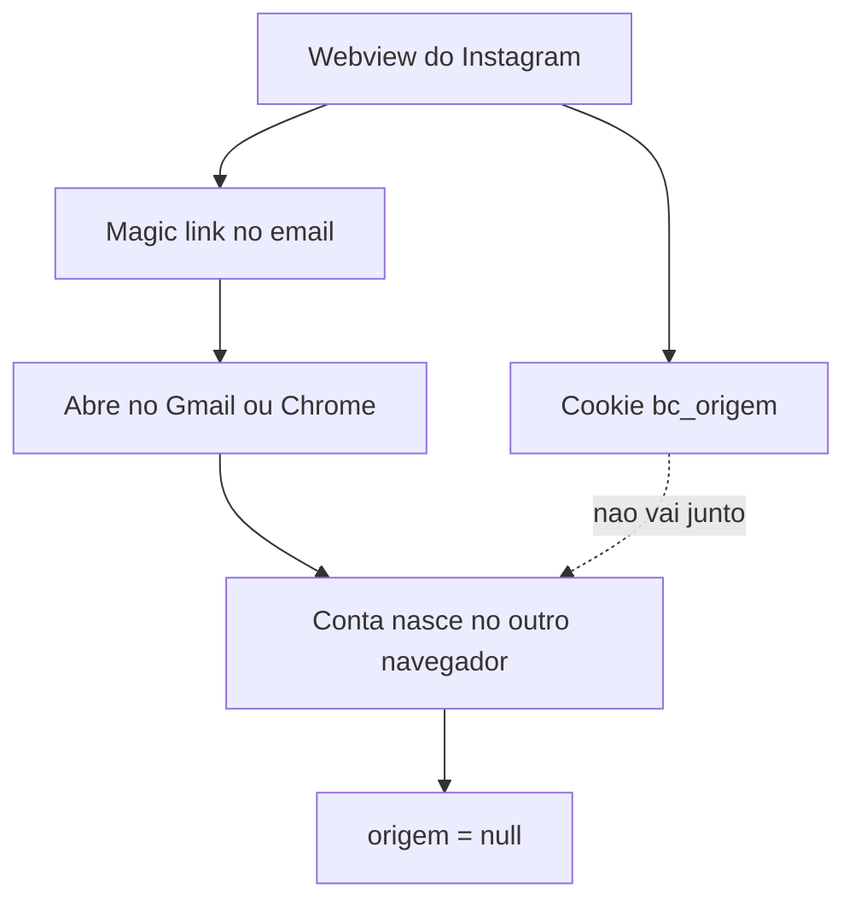
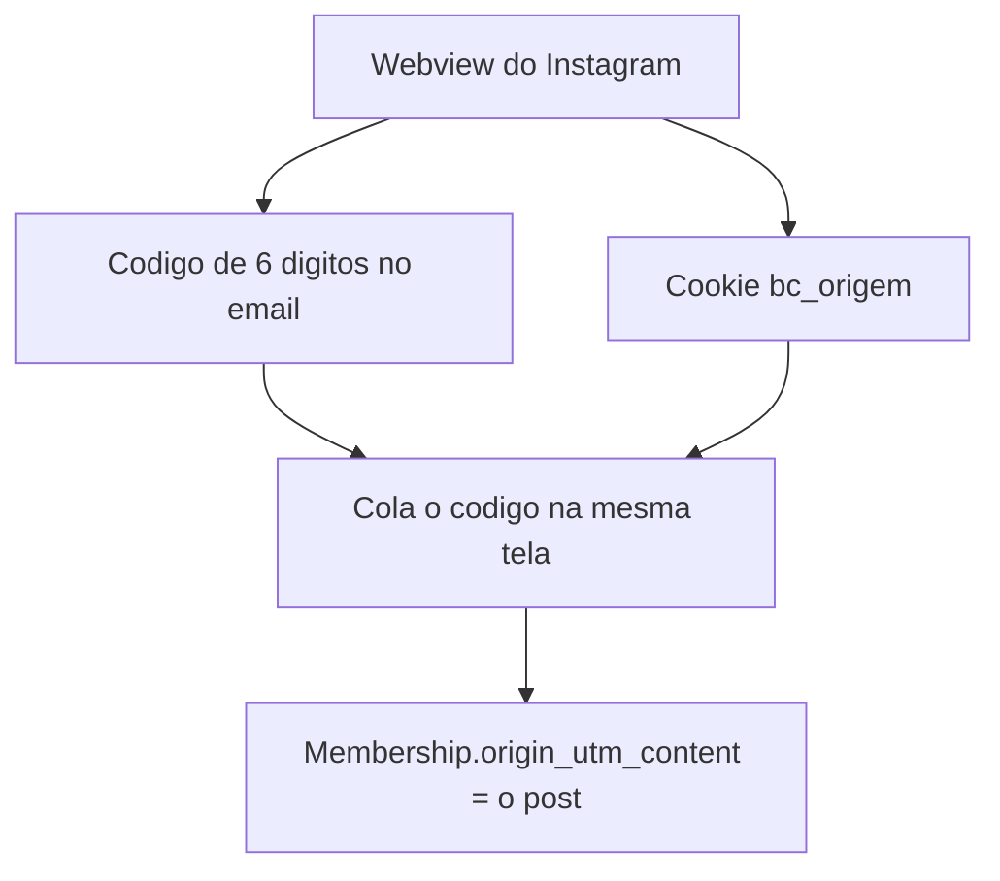
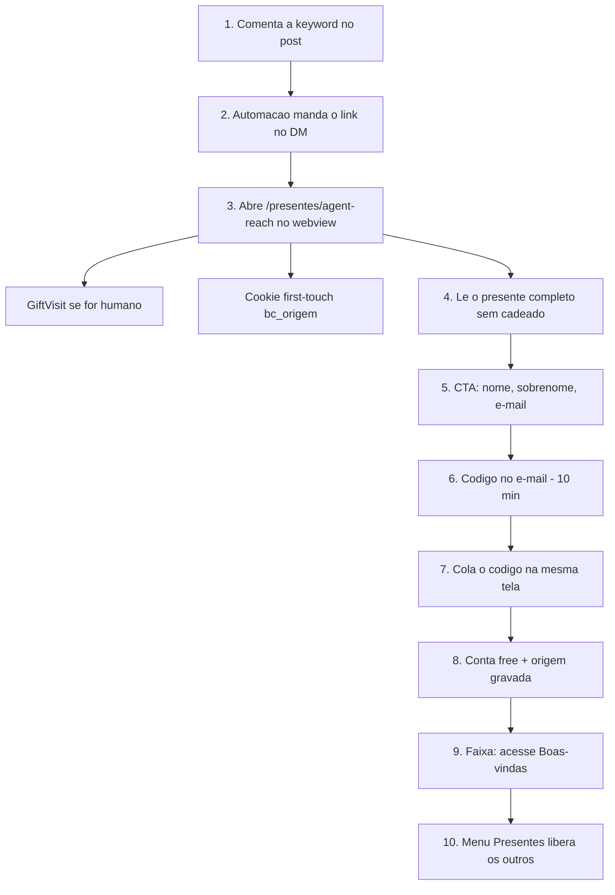
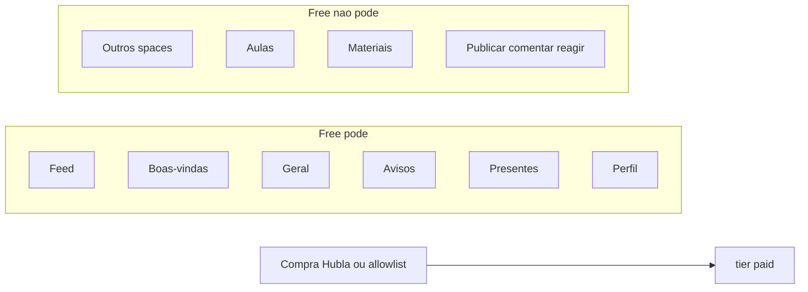
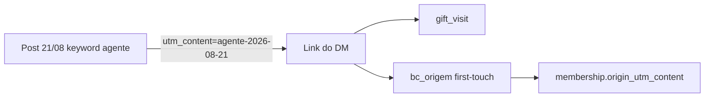

# Presentes públicos: cadastro free + atribuição por post

Documento de alinhamento (F059 / ADR-009). Spec canônica:
[`specs/02-features/F059-presentes-publicos-atribuicao.md`](../specs/02-features/F059-presentes-publicos-atribuicao.md)
e [`specs/04-decisions/ADR-009-otp-email.md`](../specs/04-decisions/ADR-009-otp-email.md).

## Em uma frase

O DM do Instagram deixa de apontar para o Notion. Aponta para o Builders Club.
A pessoa lê o presente sem conta, cria conta **grátis com código no e-mail**
(na mesma tela) e a Dev sabe **de qual post** ela veio.

O CTA **não** é mais “Garantir minha matrícula” (checkout). É **criar conta no
Builders Club**.

## Diagramas

Arquivos em [`docs/diagramas/`](diagramas/) (PNG sketch + SVG).

### 1. Jornada do aluno

Do comentário no Instagram até a conta free, com a origem do post gravada.



### 2. Por que OTP, e não magic link

Magic link abre outro navegador e perde o cookie. OTP cola o código na mesma aba.



### 3. Como medir qual post trouxe gente

O identificador é o `utm_content`. Visitas em `GiftVisit`; cadastros em `Membership.origin`.



---

## Hoje vs. depois



| | Hoje | F059 |
|--|------|------|
| Link do DM | Notion | `/presentes/agent-reach?utm_…` |
| CTA | Checkout / matrícula | Cadastro free no Club |
| Medição | Quase nenhuma (Notion) | Visitas + cadastros por post |
| Acesso | — | Conta **free** (F041) |

O texto do presente (ex.: Agent Reach) vira um **post no space Presentes**.
Migrar o conteúdo do Notion em massa ficou fora deste PR: o admin publica o
primeiro presente com slug.

---

## Por que não é magic link

Magic link **continua** em `/login` para quem já entra pelo site.

Nesse funil ele falha:



- **Google** recusa webview (`disallowed_useragent`).
- **Magic link** cria a sessão onde o e-mail foi aberto, não no Instagram.
- **OTP** (código de 6 dígitos): a pessoa volta para a **mesma aba** e cola o
  código. Cookie ainda está lá. Origem fecha.



---

## Fluxo do aluno



Link que a automação passa a usar (um `utm_content` **por post**):

```
https://comunidade-builders-club.devemdobro.com/presentes/agent-reach
  ?utm_source=instagram
  &utm_medium=dm
  &utm_campaign=presentes
  &utm_content=agente-2026-08-21
```

| Parâmetro | Valor | Papel |
|-----------|-------|--------|
| path | `/presentes/agent-reach` | qual presente |
| `utm_source` | `instagram` | de onde |
| `utm_medium` | `dm` | como chegou |
| `utm_campaign` | `presentes` | a iniciativa |
| **`utm_content`** | `agente-2026-08-21` | **o post** (keyword + data ISO) |

`igshid` e outros parâmetros do Instagram são ignorados; a página não quebra.

Em **local**: o código cai no Mailpit (`http://localhost:8026`), não no Gmail.
Em **staging/prod**: Resend manda para o e-mail real.

---

## O que o free vê

Cadastro pelo presente usa o funil que já existe (F041). F059 só **libera o
space Presentes** para o free — senão a pessoa cria a conta e leva cadeado no
que o Instagram prometeu.



Upgrade depois: mesmo fluxo de hoje. Cruzar “este post gerou este pago” fica
para depois — a origem já está no Membership.

---

## Como a Dev mede o post

O post do Instagram **não é gravado**. O identificador é o `utm_content`.



Dois degraus (as pontas de cima — comentário e DM — já existem na automação):

```
comentários → DMs enviadas → visitas no presente → cadastros
 Instagram     automação         GiftVisit           Membership
```

| Pergunta | Tabela | Campo |
|----------|--------|--------|
| Quantos **abriram** o link deste post? | `gift_visit` | `utm_content` |
| Quantos **criaram conta** por este post? | `membership` | `origin_utm_content` |

```sql
-- cadastros deste post
SELECT u.email, m.origin_utm_content, m.origin_gift_slug, m.origin_at
FROM membership m
JOIN "user" u ON u.id = m.user_id
WHERE m.origin_utm_content = 'agente-2026-08-21';

-- funil do post: visitas vs cadastros
SELECT
  (SELECT count(*) FROM gift_visit WHERE utm_content = 'agente-2026-08-21') AS visitas,
  (SELECT count(*) FROM membership WHERE origin_utm_content = 'agente-2026-08-21') AS cadastros;
```

Regras:

- **First-touch:** se a pessoa abrir três presentes antes de cadastrar, o
  crédito é do **primeiro** `utm_content`. Cookie ~90 dias.
- Login de quem **já tinha conta** não altera a origem.
- `origin_at IS NULL` = cadastro antigo. Não é “origem desconhecida”: é
  irrecuperável. Relatório filtra `origin_at IS NOT NULL`.
- Unfurl do Meta (preview do DM) **não** conta como visita. Crawler
  (`facebookexternalhit`, etc.) é descartado. O webview humano do Instagram
  **conta** — o UA humano também contém “Instagram”, então o filtro não pode
  ser “qualquer UA com Instagram”.

Ainda **não** tem tela na Admin. A leitura é por SQL.

---

## O que o admin faz no Club

1. Nova publicação → space **Presentes**.
2. Cola o conteúdo (o que hoje está no Notion).
3. Preenche o **slug** (`agent-reach`). Sem slug o post **não** é público.
4. A URL pública é `/presentes/agent-reach`.
5. Essa URL + UTM vai para a automação do Instagram.

Comentários no space Presentes ficam desligados (conteúdo, não conversa).

---

## O que não entra agora

- Tela Admin de conversão por post
- Migrar todos os presentes do Notion
- Atribuir upgrade free → pago ao post (a origem já está no membro)
- OTP na tela `/login` (Google e magic link permanecem lá)
- Teste ponta a ponta **dentro do Instagram** — isso é Preview/staging, não
  produção.

> ✅ **Domínio confirmado em 04/09/2026.** O host do app é
> `comunidade-builders-club.devemdobro.com`. O `builders-club.devemdobro.com`
> que este doc trazia antes é uma landing estática de outro projeto e dá 404 em
> `/presentes/<slug>` — link do DM apontando para lá não abre o Presente, não
> grava `GiftVisit` e não cria cookie de origem. Evidência em
> [`docs/deploy-vercel.md`](deploy-vercel.md#verificação-dos-domínios--04092026).

---

## Como testar local

App: `http://localhost:3000`  
Mailpit: `http://localhost:8026`

1. Admin publica um presente com slug `agent-reach`.
2. Abre (deslogado):

```
http://localhost:3000/presentes/agent-reach
  ?utm_source=instagram
  &utm_medium=dm
  &utm_campaign=presentes
  &utm_content=agente-2026-08-21
```

3. Lê o texto, preenche o cadastro, pega o código no Mailpit, cola na tela.
4. Confere `membership.origin_utm_content = 'agente-2026-08-21'`.
5. Free: Presentes sem cadeado; aulas/materiais com cadeado.
